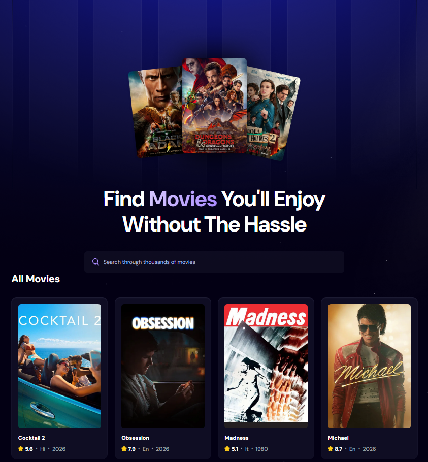
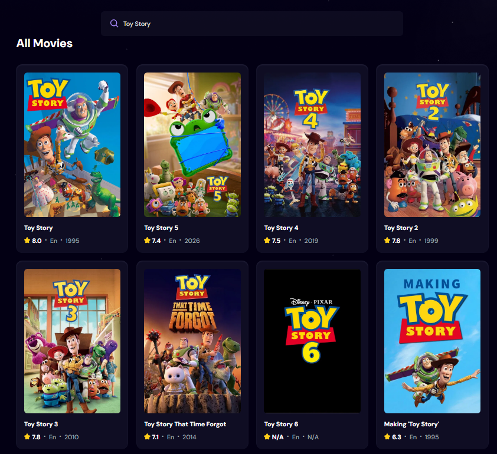

# 🎬 Movie Discovery App

A modern movie discovery web application built with **React** and **Vite** that allows users to browse popular movies and search for titles using The Movie Database (TMDB) API. The application features a responsive interface, debounced search for efficient API requests, and dynamic rendering of movie information.

---

## 🚀 Features

- 🔍 Search for movies by title
- 🎥 Browse trending and popular movies
- ⚡ Debounced search to reduce unnecessary API requests
- 📱 Responsive and modern UI
- ⏳ Loading spinner while fetching data
- ❌ Error handling for failed API requests
- 🎬 Movie cards displaying posters and movie information

---

## 🛠️ Built With

- React
- Vite
- JavaScript (ES6+)
- CSS
- TMDB API
- react-use (for debounced search)

---

## 📂 Project Structure

```
src/
│
├── components/
│   ├── MovieCard.jsx
│   ├── Search.jsx
│   └── Spinner.jsx
│
├── App.jsx
├── App.css
└── main.jsx
```

---

## 📦 Installation

Clone the repository:

```bash
git clone https://github.com/yourusername/movie-discovery-app.git
cd movie-discovery-app
```

Install dependencies:

```bash
npm install
```

Create a `.env` file in the project root:

```env
VITE_TMDB_API_KEY=your_tmdb_bearer_token
```

Start the development server:

```bash
npm run dev
```

Open your browser and navigate to:

```
http://localhost:5173
```

---

## 🔑 Environment Variables

This project requires a TMDB API Bearer Token.

```
VITE_TMDB_API_KEY=your_tmdb_bearer_token
```

You can obtain one by creating an account at:

https://developer.themoviedb.org/

---

## 📸 Screenshots

<table>
    <tr align="center">
        <td>
        <b>Home</b><br>
        
        </td>
    </tr>
    <tr>
        <td align="center">
        <b>Search</b><br>
        
        </td>
    </tr>
</table>


---

## 💡 What I Learned

This project helped strengthen my understanding of:

- React functional components
- React Hooks (`useState`, `useEffect`)
- API integration using `fetch`
- Environment variables with Vite
- Debouncing user input
- Conditional rendering
- Component-based architecture
- Error handling and loading states

---

## 🔮 Future Improvements

- Infinite scrolling
- Movie details page
- User authentication
- Favorites / Watchlist
- Dark mode
- Genre filtering
- Search history

---

## 📄 License

This project is open source and available under the MIT License.